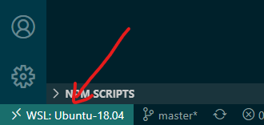
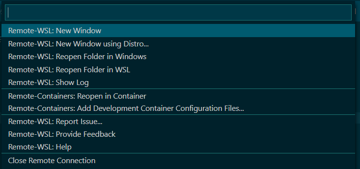

# VSC UBI NodeJS Remote Development Container Template
This simply is a template for a Visual Studio Code remote development container project using Red Hat UBI as the base image and NodeJS development tools.

## Prerequisites
If you are running Visual Studio on Microsoft Windows, you will need the following:

1. Microsoft Windows Subsystem for Linux 2 (WSL2)
1. Docker CE installed in WSL2
1. Docker Desktop for Windows installed (https://docs.docker.com/docker-for-windows/install/) and configured to run Linux containers in WSL2
1. Visual Studio Code installed (https://code.visualstudio.com/download)
1. Visual Studio Code extensions installed
   1. Docker extension (Microsoft)
   1. Remote Development extension (Microsoft)

## Getting Started

1. Fork this git repo
1. Clone the forked repo to your local repo within your WSL2 environment
1. Start an integrated terminal within Visual Studio Code
1. Check to make sure that all of the project contents including the containerfs folder is own by your username and group (and not owned by root:root)
1. Start the development container (
   1. Select the lower-left corner of the Visual Studio Code window
   
   1. Select from the list "Remote-Container: Reopen in container"
   
1. From the host machine WSL2 terminal, execute "docker ps" to view the container and the TCP/UDP port used to map to the container port

## Information Resources
To learn more about using remote development containers, please refer to the following links:

1. https://code.visualstudio.com/docs/remote/containers
1. https://code.visualstudio.com/docs/remote/containers-advanced

For information about Red Hat UBI 8 container images, please refer to the following links:

1. https://catalog.redhat.com/software/containers/search?q=ubi8
1. https://access.redhat.com/containers/#/registry.access.redhat.com/ubi8
1. https://access.redhat.com/containers/#/registry.access.redhat.com/ubi8/ubi
1. https://access.redhat.com/containers/#/registry.access.redhat.com/ubi8/ubi-minimal

For information about NodeJS, please refer to the following links:

1. https://nodejs.org/en/